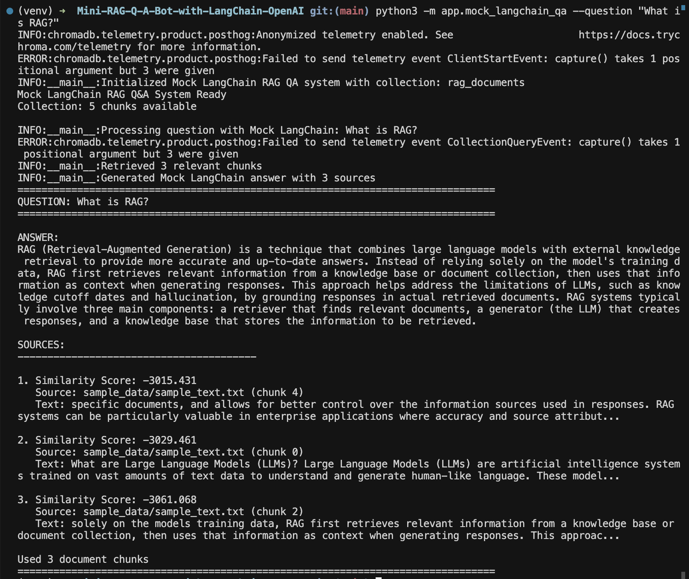

# RAG Q&A Bot with LangChain and OpenAI

A complete, production-ready Retrieval-Augmented Generation (RAG) question-answering system built with Python, **LangChain**, OpenAI, and Chroma. This project demonstrates how to build an AI system that can answer questions based on your own documents by combining semantic search with large language models using **LangChain's powerful abstractions**.

## ⚡ Quick Start (30 seconds)

```bash
# Clone and setup
git clone <your-repo-url>
cd rag-qa-langchain-openai
python3 -m venv venv
source venv/bin/activate
pip install -r requirements.txt

# Run complete demo
./demo_complete.sh
```

**That's it!** The demo will automatically ingest sample data and test the system with multiple questions.

## 📸 Demo



*The system answering "What is RAG?" with source attribution and similarity scores*

## 🚀 What is RAG?

**Retrieval-Augmented Generation (RAG)** is a powerful AI technique that:

- **Retrieves** relevant information from a knowledge base using semantic search
- **Augments** the LLM's context with retrieved documents  
- **Generates** accurate, grounded responses with source attribution
- **Reduces hallucination** by grounding answers in actual documents
- **Enables up-to-date knowledge** beyond the model's training cutoff

This demo shows how RAG works by ingesting documents, creating embeddings, storing them in a vector database, and using them to answer questions with proper source citations.

## 🔗 LangChain Features Used

This project demonstrates key LangChain components:

- **Document Loaders**: `TextLoader` and `PyPDFLoader` for loading various file formats
- **Text Splitters**: `RecursiveCharacterTextSplitter` for intelligent document chunking
- **Embeddings**: `OpenAIEmbeddings` for creating vector representations
- **Vector Stores**: `Chroma` integration for storing and retrieving embeddings
- **Retrievers**: `as_retriever()` for semantic search functionality
- **Chains**: `RetrievalQA` chain for question-answering workflows
- **Prompts**: `PromptTemplate` for structured prompt engineering
- **LLMs**: `ChatOpenAI` for language model integration

## 🛠️ Tech Stack

- **Python 3.10+** - Core language
- **LangChain** - LLM framework with document loaders, text splitters, embeddings, and chains
- **LangChain OpenAI** - OpenAI integration for embeddings and chat models
- **LangChain Community** - Document loaders for PDF and text files
- **OpenAI** - Embeddings and text generation
- **Chroma** - Local vector database
- **FastAPI** - Web API framework
- **PyPDF2** - PDF document processing
- **pytest** - Testing framework

## 📁 Project Structure

```
rag-qa-langchain-openai/
├── app/
│   ├── __init__.py
│   ├── config.py                    # Configuration and environment variables
│   ├── utils.py                     # Text processing utilities
│   ├── ingest.py                    # LangChain document ingestion and embedding
│   ├── qa.py                        # LangChain question-answering logic
│   ├── mock_ingest.py               # Original direct API mock ingestion
│   ├── mock_qa.py                   # Original direct API mock Q&A
│   ├── mock_langchain_ingest.py     # LangChain mock ingestion
│   ├── mock_langchain_qa.py         # LangChain mock Q&A
│   └── server.py                    # FastAPI web server
├── sample_data/
│   └── sample_text.txt              # Sample documents for testing
├── scripts/
│   ├── run_ingest.sh                # Document ingestion script
│   └── start_server.sh              # Server startup script
├── tests/
│   └── test_utils.py                # Unit tests
├── requirements.txt                 # Python dependencies
├── .gitignore                      # Git ignore rules
├── demo_output.txt                 # Example outputs
├── demo_complete.sh                # Original demo script
├── demo_langchain.sh               # LangChain demo script
└── README.md                       # This file
```

## 🚀 How to Run the Model

### Method 1: Quick Demo (Recommended for First Time)

**Run the LangChain demo in one command:**
```bash
./demo_langchain.sh
```
This will automatically ingest sample data using LangChain and test the system with multiple questions.

**Or run the original demo:**
```bash
./demo_complete.sh
```

### Method 2: Step-by-Step Setup

#### Step 1: Environment Setup
```bash
# Clone the repository
git clone <your-repo-url>
cd rag-qa-langchain-openai

# Create virtual environment
python3 -m venv venv
source venv/bin/activate  # On Windows: venv\Scripts\activate

# Install dependencies
pip install -r requirements.txt
```

#### Step 2: Choose Your Mode

**Option A: LangChain Mock Mode (No API Key Required)**
```bash
# Ingest with LangChain document loaders and mock embeddings
python3 -m app.mock_langchain_ingest sample_data/

# Run LangChain Q&A system
python3 -m app.mock_langchain_qa --question "What is RAG?"

# Or run interactively
python3 -m app.mock_langchain_qa
```

**Option B: LangChain Real Mode (Requires OpenAI API Key)**
```bash
# Set your OpenAI API key
export OPENAI_API_KEY="your-openai-api-key-here"

# Ingest with LangChain document loaders and real embeddings
python3 -m app.ingest sample_data/

# Run LangChain Q&A system
python3 -m app.qa --question "What is RAG?"

# Or run interactively
python3 -m app.qa
```

**Option C: Original Direct API Mode (Requires OpenAI API Key)**
```bash
# Set your OpenAI API key
export OPENAI_API_KEY="your-openai-api-key-here"

# Ingest with direct OpenAI API calls
python3 -m app.mock_ingest sample_data/

# Run direct API Q&A system
python3 -m app.mock_qa --question "What is RAG?"
```

#### Step 3: Web Interface (Optional)
```bash
# Start the web server
./scripts/start_server.sh

# Visit http://127.0.0.1:8000 in your browser
# Or test with curl:
curl -X POST "http://127.0.0.1:8000/ask" \
  -H "Content-Type: application/json" \
  -d '{"question":"What is RAG?"}'
```

### Method 3: Using Helper Scripts

```bash
# Make scripts executable
chmod +x scripts/*.sh

# Ingest documents
./scripts/run_ingest.sh

# Start web server
./scripts/start_server.sh
```

## ⚙️ Configuration Options

### Model Selection
You can change the OpenAI model in `app/config.py` or set environment variable:
```bash
export OPENAI_MODEL="gpt-4o-mini"  # Default, cost-effective
export OPENAI_MODEL="gpt-4o"       # More capable
export OPENAI_MODEL="gpt-3.5-turbo" # Faster, cheaper
```

### Chunking Parameters
Modify in `app/config.py`:
- `CHUNK_SIZE`: Text chunk size in characters (default: 500)
- `CHUNK_OVERLAP`: Overlap between chunks (default: 50)
- `TOP_K_RESULTS`: Number of chunks to retrieve (default: 3)

## 📖 Usage Examples

### CLI Usage

**LangChain Mock Mode (No API Key):**
```bash
# Single question
python3 -m app.mock_langchain_qa --question "What is RAG?"

# Interactive mode
python3 -m app.mock_langchain_qa
```

**LangChain Real Mode (With API Key):**
```bash
# Single question
python3 -m app.qa --question "What is RAG?"

# Interactive mode
python3 -m app.qa
```

**Original Direct API Mode:**
```bash
# Single question
python3 -m app.mock_qa --question "What is RAG?"

# Interactive mode
python3 -m app.mock_qa
```

### API Usage

```bash
# Start server (requires API key)
python3 -m app.server

# Ask questions via API
curl -X POST "http://127.0.0.1:8000/ask" \
  -H "Content-Type: application/json" \
  -d '{"question": "How do LLMs work?"}'
```

### Web Interface

Visit `http://127.0.0.1:8000` for a simple web form to ask questions.

## 🔧 Troubleshooting

### Common Issues

**1. "Command not found: python"**
```bash
# Use python3 instead
python3 -m app.mock_qa --question "What is RAG?"
```

**2. "Collection not found"**
```bash
# Run ingestion first
python3 -m app.mock_ingest sample_data/
```

**3. "API key not set"**
```bash
# For mock mode, no API key needed
python3 -m app.mock_qa

# For real mode, set API key
export OPENAI_API_KEY="your-key-here"
python3 -m app.qa
```

**4. "Permission denied" on scripts**
```bash
# Make scripts executable
chmod +x scripts/*.sh
chmod +x demo_complete.sh
```

**5. "Module not found" errors**
```bash
# Ensure virtual environment is activated
source venv/bin/activate
pip install -r requirements.txt
```

### Performance Tips

- **Mock mode** is faster and doesn't require API calls
- **Real mode** provides better answers but costs money
- **Chunk size** affects retrieval quality (smaller = more precise)
- **Top K results** affects answer quality (more = more context)

## 🧪 Testing

```bash
# Run unit tests
pytest tests/

# Run with verbose output
pytest tests/ -v
```

## 📊 Sample Questions to Try

- "What is RAG?"
- "How do LLMs work?"
- "What are the benefits of RAG?"
- "How does RAG improve AI responses?"
- "What are the components of a RAG system?"

## 🔧 Configuration

Key settings in `app/config.py`:

- `OPENAI_MODEL`: LLM model to use (default: "gpt-4o-mini")
- `EMBEDDING_MODEL`: Embedding model (default: "text-embedding-3-small")
- `CHUNK_SIZE`: Text chunk size in characters (default: 500)
- `CHUNK_OVERLAP`: Overlap between chunks (default: 50)
- `TOP_K_RESULTS`: Number of chunks to retrieve (default: 3)

## 📈 Performance Notes

- **Embedding Creation**: ~1-2 seconds per document
- **Query Processing**: ~2-5 seconds per question
- **Storage**: ~1MB per 1000 chunks in Chroma DB
- **Memory**: ~200MB for typical document collections

## 🚀 Deployment to GitHub

```bash
# Initialize git repository
git init
git add .
git commit -m "Initial commit: RAG Q&A system"

# Create GitHub repository and push
git remote add origin https://github.com/yourusername/rag-qa-langchain-openai.git
git branch -M main
git push -u origin main
```

## 🎯 What to Say in Interview

**"I built a complete RAG system that demonstrates how to ground AI responses in retrieved documents. The project shows my understanding of vector embeddings, semantic search, and prompt engineering. I learned how to chunk documents effectively, create embeddings with OpenAI, store them in Chroma for fast retrieval, and design prompts that encourage source attribution. The system includes both CLI and web interfaces, proper error handling, and unit tests - showing I can build production-ready AI applications."**

## 🔍 Key Technical Learnings

- **Vector Embeddings**: Converting text to numerical representations for semantic search
- **Document Chunking**: Breaking large documents into searchable pieces with overlap
- **Retrieval**: Using similarity search to find relevant context
- **Prompt Engineering**: Designing prompts that encourage accurate, cited responses
- **Vector Databases**: Storing and querying embeddings efficiently with Chroma
- **API Design**: Building clean REST APIs with FastAPI and proper error handling

## 📝 License

MIT License - feel free to use this project for learning and interviews!

## 🤝 Contributing

This is a demo project, but suggestions and improvements are welcome!

---

**Ready to run in 1-2 hours!** 🚀

